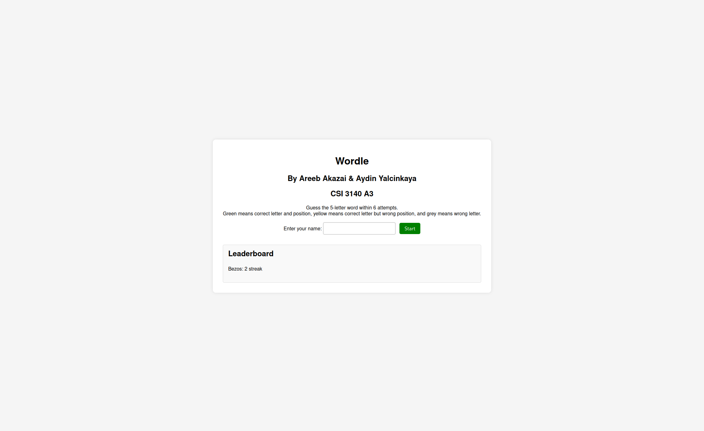
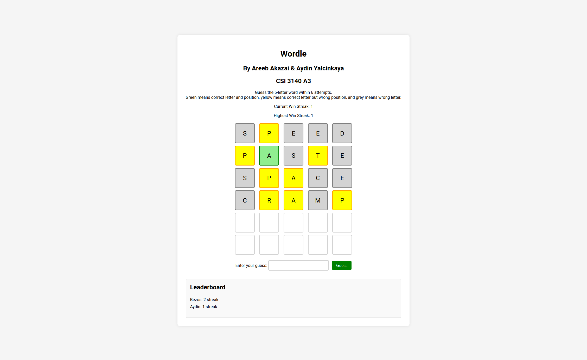
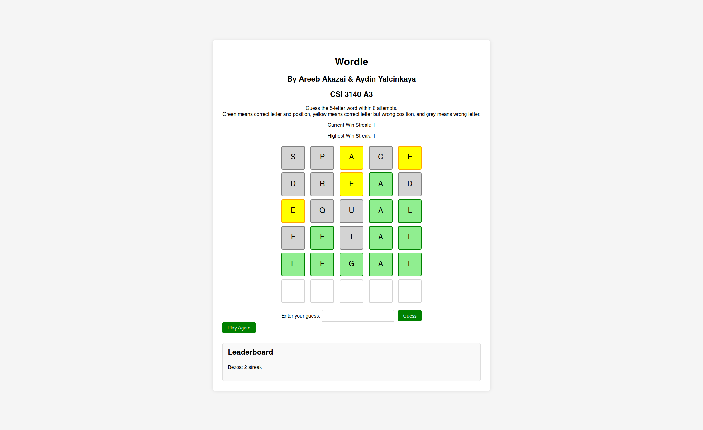
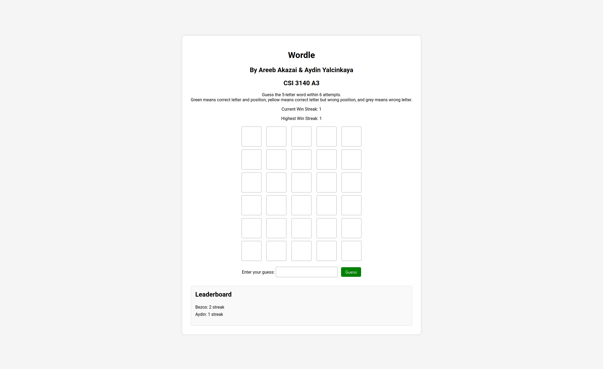
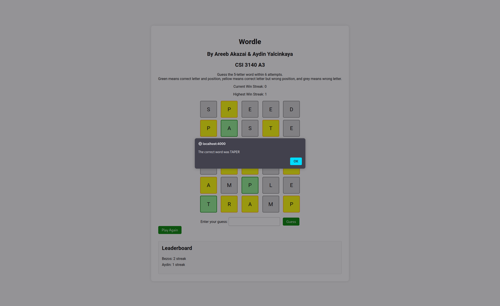

# Wordle Game - PHP Enhanced
### CSI3140 A3

## Overview
A server-enhanced version of the classic Wordle game where all game logic is handled via a PHP backend, exposing game functionality through a JSON API. The JavaScript frontend focuses solely on rendering the game state.

## How to Play
- Download or clone the repository.
- Run the project on a server with PHP support (like XAMPP or WAMP).
- Open the provided HTML file in a browser to start the game.
- Enter your guesses to try and match the word selected by the server.

## Features
- **Server-side Game State Management**: Game state, including win streaks and guesses, is stored on the server using PHP sessions.
- **JSON API Interaction**: Frontend makes AJAX calls to interact with the backend, ensuring separation of concerns.
- **Dynamic Leaderboard**: Tracks top 10 scores using server-side storage, displaying them dynamically in the game interface.
- **Secure and Validated Inputs**: Implements strict validation to ensure that all user inputs are safe and correct, preventing common web vulnerabilities.

## Screenshots
- **Game Start**: 
- **Mid Game**: 
- **Game Win**: 
- **Game Win Play Again**: 
- **Game Lose**: 

## Setup
Instructions on how to set up and run the game locally:
1. Ensure you have a PHP server environment.
2. Place the game files in your server's document root.
3. Access the game via your browser by navigating to the appropriate URL, typically something like `http://localhost/path/to/game`.

## Credits
Developed by Areeb Akazai & Aydin Yalcinkaya as part of CSI 3140 A3.

.
